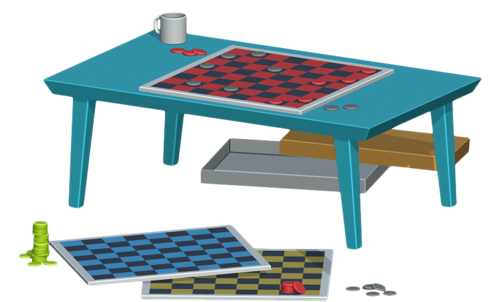

<p align="center">

</p>

---
Compete with individuals all over the world on a variety of sporting, gaming and e-sport events. Pick an event, talk your trash, vote and see if you picked the correct winner.

[Check out the deployed site here] (DEPLOYED SITE)

## Table of Contents

* [User Story](#user-story)
  
* [Installation](#installation)

* [Technology](#technology)
  
* [Functionality](#functionality)
  
* [Future Developments](#future-developments)

* [Links and Screenshots](#links-and-screenshots)

* [Created By](#created-by)

* [License](#license)

## User Story
On average, 150 million individuals per year attend professional sporting events. During a global pandemic, spectator attendance deminishes to almost 0. We have developed an app that brings people together and creates an environment to compete against each other.

<p align="center">



</p>
``` 
AS an individual, I enjoy spending time with my friends by going to sporting events or watching games and events on TV.  
I WANT to be able to connect, debate, and converse over outcomes of games/events. 
AND I want to be able to debate a variety of different events.
SO I can feel connected to a group of individuals that have the same interest as me, anywhere anytime. 

```

## Installation

To use this project, first clone the repo in your terminal using the command below:
```
$ git clone https://github.com/Bertodemus/LeopardLightning.git
```

Once the repo is cloned, run the following command:
```
$ npm i
```
You must create the following database in MySQL: 

```
CREATE DATABASE passport_demo;
```

Once created, change any necessary requirements in config.json file: 

```json
{
  "development": {
    "username": "root",
    "password": "",
    "database": "passport_demo",
    "host": "127.0.0.1",
    "dialect": "mysql"
  }
```
To run the server, run the following command in your terminal:

```
$ node server
```
## Technology


### APIs and Libraries
-   Bootstrap
-   Handlebars
-   Sequelize
-   MySQL
-   Express
-   Passport
-   Jdenticon

## Functionality
```
GIVEN a login page, I have the choice to either login or sign up
THEN I type in my email address and password
WHEN I click submit I am redirected to the members page
THEN I am presented with a list of actions for me to choose from
WHEN I click “Create Event” I am presented with a form
THEN I fill out the corresponding information for the event I would like to create
WHEN I click “Generate”, the event will be created for others to debate on
WHEN I click "All Events", I am presented with the main page
THEN I can see all the couch, table and turf events with an individualized description
WHEN I click on an event button I am redirected to that event's specific page
THEN I am able to see the two teams/players who are competing and who members are voting for, and why they believe their choice will win
WHEN I want to debate the winners, I make a comment in the comment box
THEN I click on the corresponding button associated with who I think will win
WHEN the button is clicked the comment will get populated to the appropriate column and my vote is cast
SO I can compete and connect with others, anywhere anytime. 
```

## Future Developments

### Video Capabilites 

**Allow users to watch games on the app directly**

Allowing users to watch the game and comment in one place would make for a more streamlined experience. TA members could watch live games and make comments and predictions based on what is happening in real time.

### Previous Scores and Comments

**Display previous scores and comments for teams that have competed before**

Displaying previous official win/loss record, comments and user input on who was projected to win, would help the user formulate a clearer decision on who they believe the winner will be. Looking at previous content might strength or weaken their prediction. 


## Links and Screenshots
Repo: https://github.com/Bertodemus/LeopardLightning

Deployed App: LINK HERE

Login Page:


## Created by
- [David Stinnet](https://github.com/serjykalstryke "Visit David's GitHub")
- [Roberto Rubet](https://github.com/Bertodemus "Visit Berto's GitHub")
- [Jordan Sarvay](https://github.com/Jsarvay "Visit Jordan's GitHub")
- [Meaghan Neylon](https://github.com/neylonmc "Visit Meaghan's GitHub")

## License
[](https://opensource.org/licenses/MIT)


<p align="center">


</p>