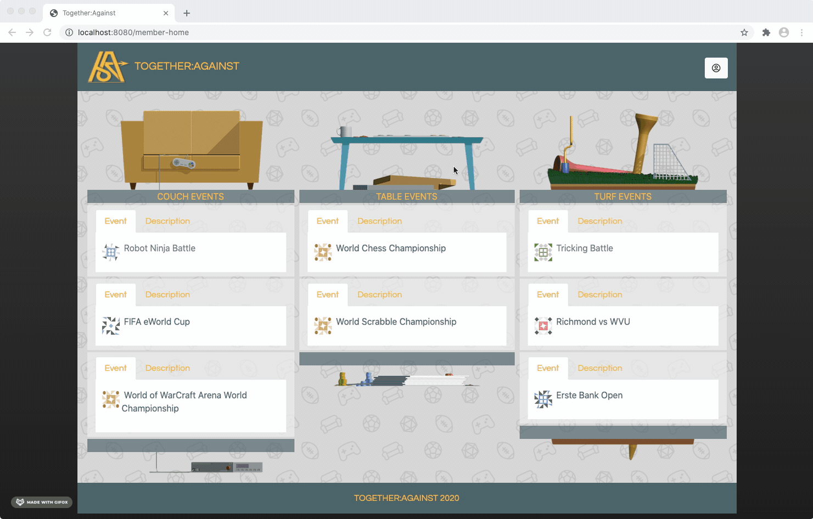
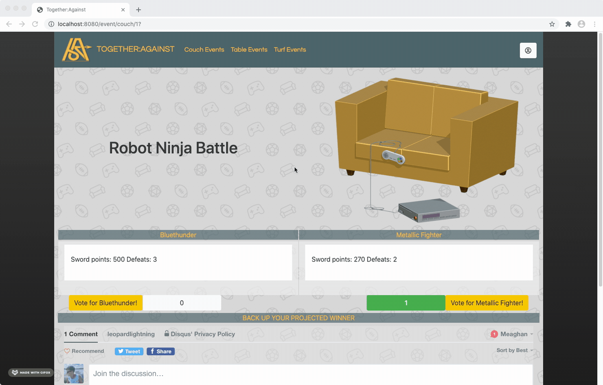

<p align="center">

</p>

---
Compete with individuals all over the world on a variety of sporting, gaming and e-sport events. Pick an event, talk your trash, vote and see if you picked the correct winner.

[Check out the deployed site here](https://leopard-ta.herokuapp.com/)

## Table of Contents

* [User Story](#user-story)
  
* [Installation](#installation)

* [Technology](#technology)
  
* [Functionality](#functionality)
  
* [Future Developments](#future-developments)

* [Links and Screenshots](#links-and-screenshots)

* [Created By](#created-by)

* [License](#license)

## User Story
On average, 150 million individuals per year attend professional sporting events. During a global pandemic, spectator attendance deminishes to almost 0. We have developed an app that brings people together and creates an environment to compete against each other.

<p align="center">


</p>
``` 
AS an individual, I enjoy spending time with my friends by going to sporting events or watching games and events on TV.  
I WANT to be able to connect, debate, and converse over outcomes of games/events. 
AND I want to be able to debate a variety of different events.
SO I can feel connected to a group of individuals that have the same interest as me, anywhere anytime. 

```

## Installation

To use this project, first clone the repo in your terminal using the command below:
```
$ git clone https://github.com/Bertodemus/LeopardLightning.git
```

Once the repo is cloned, run the following command:
```
$ npm i
```
You must create the following database in MySQL: 

```
CREATE DATABASE passport_demo;
```

Once created, change any necessary requirements in config.json file: 

```json
{
  "development": {
    "username": "root",
    "password": "",
    "database": "passport_demo",
    "host": "127.0.0.1",
    "dialect": "mysql"
  }
```
To run the server, run the following command in your terminal:

```
$ node server
```
## Technology


### APIs and Libraries
-   Bootstrap
-   Handlebars
-   Sequelize
-   MySQL
-   Express
-   Passport
-   Jdenticon
-   Disqus

## Functionality
```
GIVEN a login page, I have the choice to either login or sign up
THEN I type in my email address and password
WHEN I click submit I am redirected to the members page
THEN I am presented with a list of actions for me to choose from
WHEN I click “Create Event”, I am presented with a form
THEN I fill out the corresponding information for the event I would like to create
WHEN I click “Generate”, the event will be created for others to debate on
WHEN I click "All Events", I am presented with the main page of events
THEN I can see all the couch, table and turf events with an individualized description
WHEN I click on the event button I am redirected to that event's specific page
THEN I am able to see the two teams/players information, total vote count, and comment box
WHEN I want to join the debate, I make a comment in the comment box
THEN I vote by clicking the button associated with who I believe will win
SO I can compete and connect with others, anywhere anytime. 
```

## Future Developments

### Video Capabilites 

**Allow users to watch games on the app directly**

Allowing users to watch the game and comment in one place would make for a more streamlined experience. TA members could watch live games and make comments and predictions based on what is happening in real time.

### Previous Scores and Comments

**Display previous scores and comments for teams that have competed before**

Displaying previous official win/loss record, comments and user input on who was projected to win, would help the user formulate a clearer decision on who they believe the winner will be. Looking at previous content might strength or weaken their prediction. 

### User Ranking System

**This feature would allow members to gain points for how active they are on Together Against**

Allow members to gain points and ranking based on how many projections they get correct and how active they are on Together Against

### Event Control
**Event management would allow for a better user experience**

There are a number of additional functionalities that would make for a better user experience. Eventually, the events commenting and voting features would close after the event is finished. This would allow members to see which opponent won...without people knowing the outcome. Also, creating a search bar would allow members to quickly find an event. 

### Top Events and Highlights
**Show the people what they want to see**

Everyone loves highlights and top events when to comes to compeititons. We would like to give our members that experience. Adding a "Top Events" page would allow members to see where others are commenting and voting the most at that time. Additionally, allowing members to view and vote on top highlights throughout would add more interaction with the app. 


## Links and Screenshots
Repo: https://github.com/Bertodemus/LeopardLightning

Deployed App: https://leopard-ta.herokuapp.com/

Login Page:


Main Page: 


Individual Event Page:


Event Page:


## Created by
- [David Stinnet](https://github.com/serjykalstryke "Visit David's GitHub")
- [Roberto Rubet](https://github.com/Bertodemus "Visit Berto's GitHub")
- [Jordan Sarvay](https://github.com/Jsarvay "Visit Jordan's GitHub")
- [Meaghan Neylon](https://github.com/neylonmc "Visit Meaghan's GitHub")

## License
[](https://opensource.org/licenses/MIT)


<p align="center">


</p>